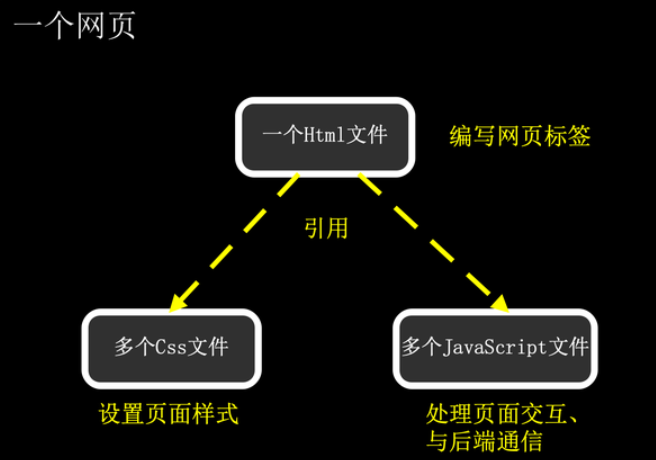

**参考的网站：**
- [从零开始创建一个网站](https://www.yunyoujun.cn/posts/how-to-build-your-site)
- [云主题](https://yun.yunyoujun.cn/guide/)
- [valaxy](https://valaxy.site/) 
- [github托管的官方文档](https://docs.github.com/zh/migrations/importing-source-code/using-the-command-line-to-import-source-code/adding-locally-hosted-code-to-github)
- [超可爱！使用 Valaxy 搭建自己的博客](https://yuumi0221.github.io/posts/valaxy#%E7%BC%96%E8%BE%91%E9%85%8D%E7%BD%AE)

作为小白，对于网站的一系列操作完全不懂，只能说是边摸索踩坑了……
所幸，阶段性成功。☆*: .｡. o(≧▽≦)o .｡.:*☆

    再回首，时隔多时，官方的说明已经显得丰富了许多…………**

#### 一些基础
- 网页是怎么工作的？
  
  网页是有静态资源（HTML、CSS、JavaScript、图片等）和动态资源（服务器端脚本）组成。

  

  在这个小项目中，使用valaxy来搭建网站。 
  
  valaxy是一个基于Vue.js和Vite的静态网站生成器。 [Vue.js](https://v2.cn.vuejs.org/v2/guide/)是构建用户界面的JavaScript框架。而[Vite](https://vitejs.dev/guide/why.html)是一个构建工具，可以快速构建现代Web应用程序，可以看成是JavaScript框架的界面生成加速器。

#### 一些学习笔记
- [git的学习](https://didididadida.github.io/posts/learn_about_git)
- [python的学习](https://didididadida.github.io/posts/learn_about_python)
  
#### 阶段性模仿
目前已经完成了基本的官方指导说明，完成了基本的博客搭建和撰写、主题配置、评论系统插入。
后续，~~如果官方有新的插件的话~~还是会继续跟进的。

